# 🏗️ Lab Infrastructure: The Dell AIO Cyber Range


## 📖 Project Overview
This project documents the design, setup, and configuration of a dedicated, isolated cybersecurity lab built around a repurposed **Dell OptiPlex All-in-One (AIO)** server and a **MacBook Pro** management station.

The goal of this infrastructure is to provide a stable, flexible, and realistic environment for hands-on cybersecurity training, threat hunting, and incident response simulation.

---

## 1. 🗺️ Lab Topology and Architecture
The lab follows a client-server model, utilizing a Type-1 hypervisor on the server (Dell AIO) and a Type-2 hypervisor on the management station (MacBook Pro).

```mermaid
graph TD
    subgraph Lab_Network [Dell AIO Server - ESXi Host]
        A[ESXi Hypervisor Kernel]
        B[VM 1 - Security Onion]
        C[VM 2 - Kali Linux]
        D[VM 3 - Target Windows]
        B --vSwitch0--> A
        C --vSwitch0--> A
        D --vSwitch0--> A
    end

    subgraph Home_Network [Physical Network]
        E[Wireless Router]
        F[MacBook Pro M2]
    end

    A --Cat 6 Ethernet Cable--> E
    E --WiFi (Mgmt Access)--> F

    style A fill:#f9f,stroke:#333,stroke-width:2px
    style F fill:#ccf,stroke:#333,stroke-width:2px

---

## 2. ⚙️ Tools and Hardware

| Category | Component | Specification | Role |
| :--- | :--- | :--- | :--- |
| **Server** | Dell OptiPlex 7440 AIO | i5-6500, 32GB RAM | Dedicated VM Host (Type 1 Hypervisor) |
| **Storage** | External SSD | 2TB SATA III | Main VM Datastore (`datastore_vm_storage`) |
| **Network** | TP-Link UE306 | USB 3.0 Gigabit | Physical Uplink |
| **Mgmt** | MacBook Pro | M2, macOS | Management Console (SSH/Web) |
| **Hypervisor** | VMware ESXi | Version 8.0 (Free License) | Core Virtualization |

---

## 3. 🛠️ Installation and Configuration Process

### 3.1 The Challenge: Creating the Installer
The installation of the ESXi hypervisor presented a key technical challenge. Standard graphical tools failed to create a bootable drive for this specific hardware configuration (Dell OptiPlex 7440).

**The Failure:**
I initially attempted to use `balenaEtcher` to flash the ISO. However, it failed to create a partition table that the Dell BIOS could recognize as a bootable device.

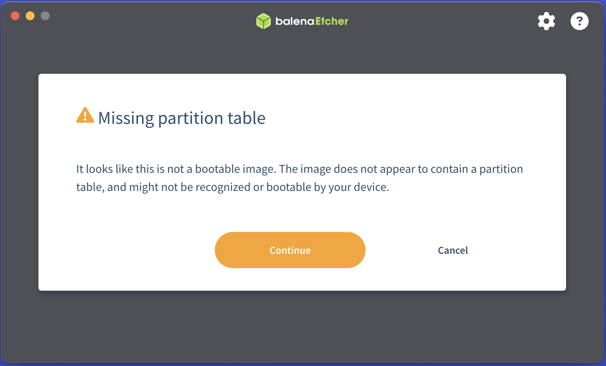 *Figure 1: BalenaEtcher warning regarding the missing partition table.*

Upon inspecting the disk after the failed attempt, `diskutil` confirmed that the partition scheme was essentially unrecognizable to the legacy BIOS boot mode required for this server.

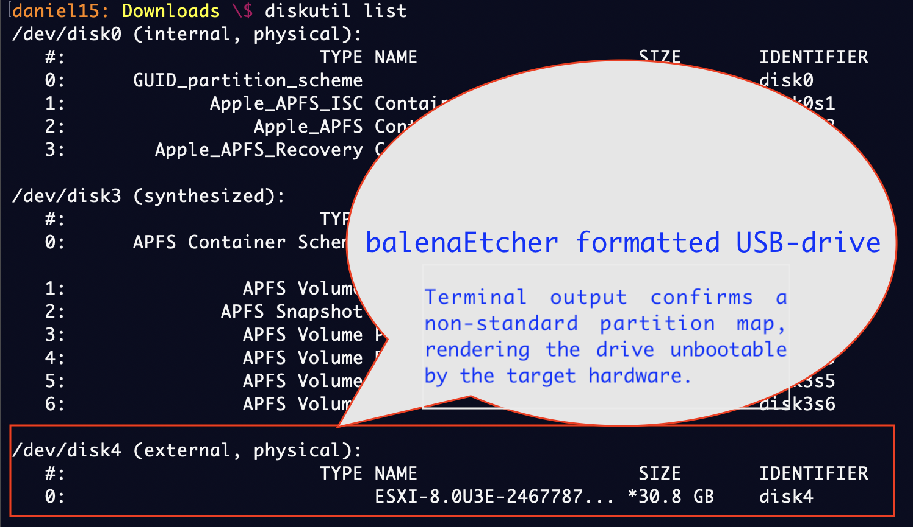 *Figure 2: Verifying the drive state using diskutil*.

### 3.2 The Solution: Native Terminal Formatting
To resolve this, I bypassed GUI tools and utilized macOS native terminal utilities to manually structure the drive with an **MBR (Master Boot Record)** partition map and **FAT32** file system.

**Step 1: Formatting and Partitioning**
```bash
diskutil eraseDisk MS-DOS "ESXI" MBR disk4

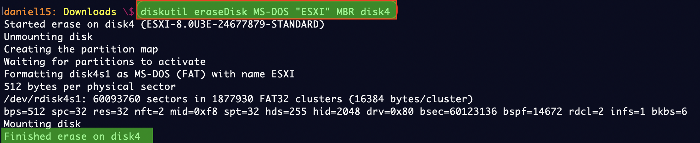

**Step 2: Marking Partition as Active via fdisk** 
Using `fdisk` was critical to flag the partition as bootable for the legacy BIOS.
```bash
sudo fdisk -e /dev/disk4
> f 1    # Flag partition 1 as active
> write  # Write changes to table
> quit

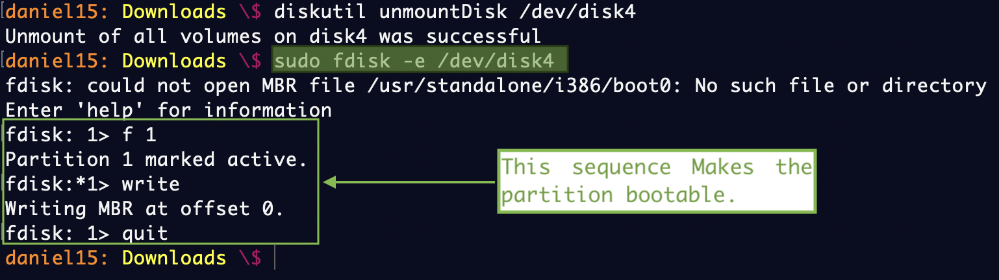

**Step 3: Mounting and Copying Files** 
With the drive prepared, I mounted the VMware installer ISO and manually copied the contents to the USB drive.
```bash
hdiutil attach VMware-VMvisor-Installer-8.0U3e-24677879.x86_64.iso
cp -Rv /Volumes/ESXI-8.0U3E-24677879-STANDARD/* /Volumes/ESXI/

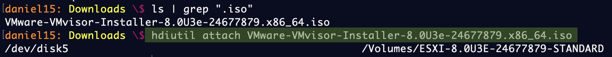 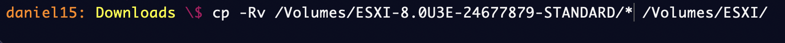

### 3.3 Boot Configuration Edit
To ensure the bootloader could locate the kernel on this specific hardware, I had to edit the `isolinux.cfg` file.
```bash
cd /Volumes/ESXI
nano isolinux.cfg

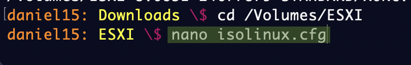 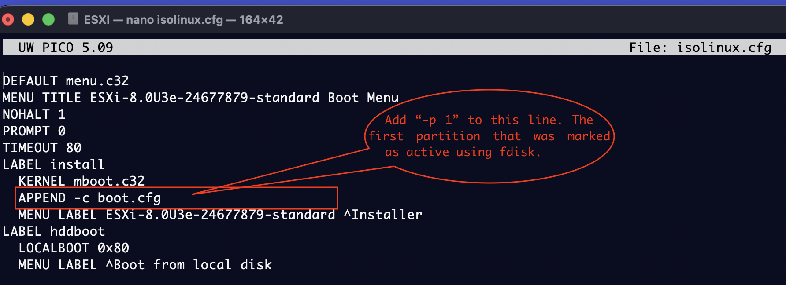

I modified the `APPEND` line to include `-p 1`. This flag helps the installer identify the correct partition for the bootbank, preventing "Bank not found" errors during the install process.

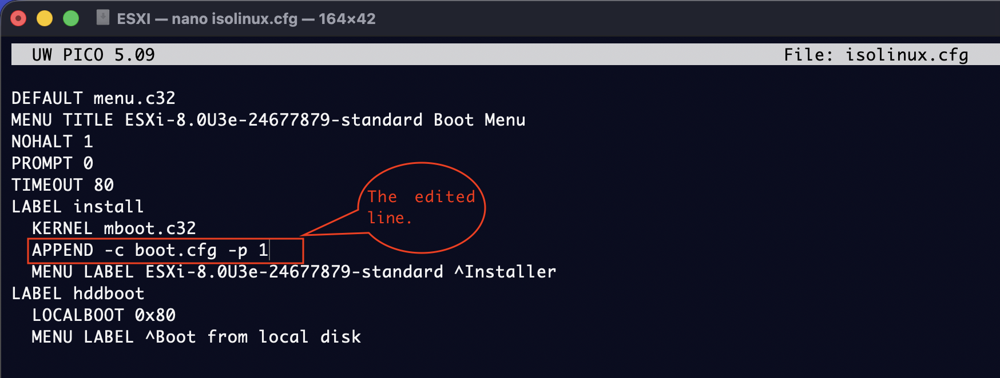 *Figure 3: Appending the partition flag to the boot config*.

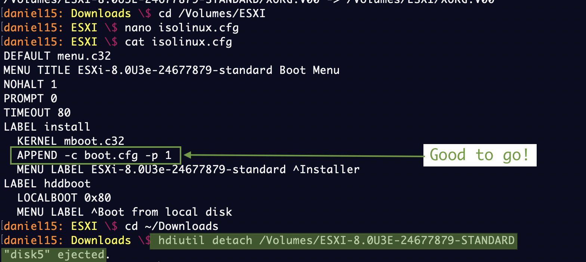 *Figure 4: Verification of the edited config file*.

### 3.4 Post-Install Configuration (DCUI)
Once the hypervisor was installed, I accessed the **Direct Console User Interface (DCUI)** directly on the Dell AIO to configure the management network.

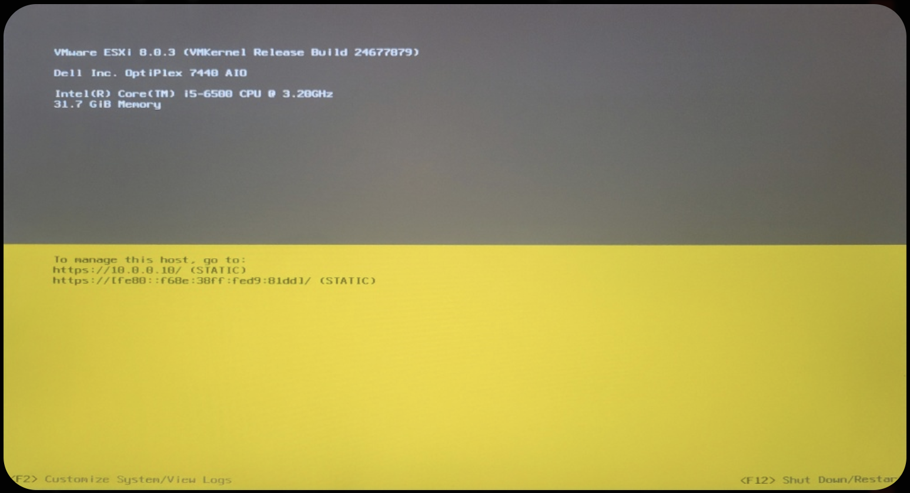 *Figure 5: Accessing the Network Management Console on the physical server*.

**Static IP Configuration**: To ensure reliable remote management, I disabled DHCP and assigned a static IP address `(10.0.0.10)` that resides outside my router's DHCP pool but within the local subnet.

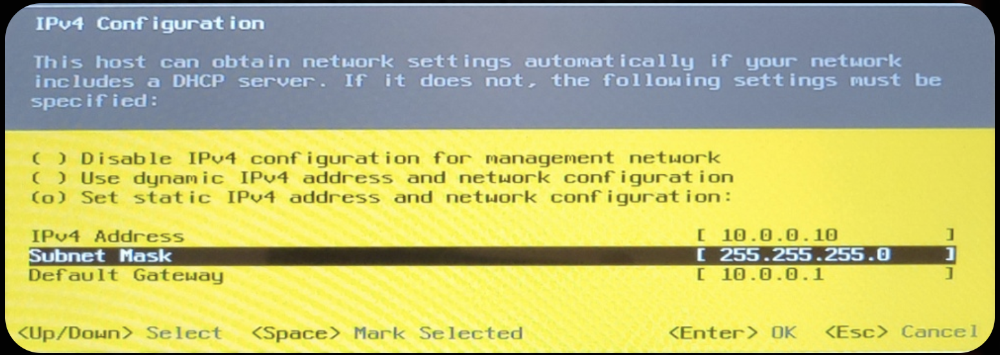 *Figure 6: Manually assigning the Static IP and Subnet Mask*.

**DNS and Hostname**: I configured the Primary DNS to point to the local gateway and the Alternate DNS to Google `(8.8.8.8)` for external resolution.

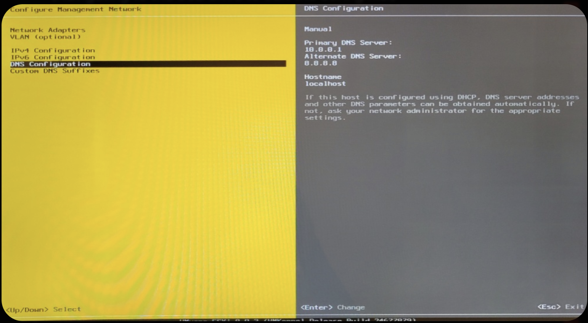 *Figure 7: Finalizing DNS settings*.

---

## 4. ✅ Final Status and Conclusion

The Dell AIO is now fully operational as a "headless" hypervisor.

**Verification of Success**: The screenshot below confirms the successful integration of all components:

 1. **Remote Access**: The connection is established via the MacBook Pro browser to `10.0.0.10`.

 2. **Storage**: The custom `datastore_vm_storage` (the 2TB external SSD) is mounted and ready for VM deployment.

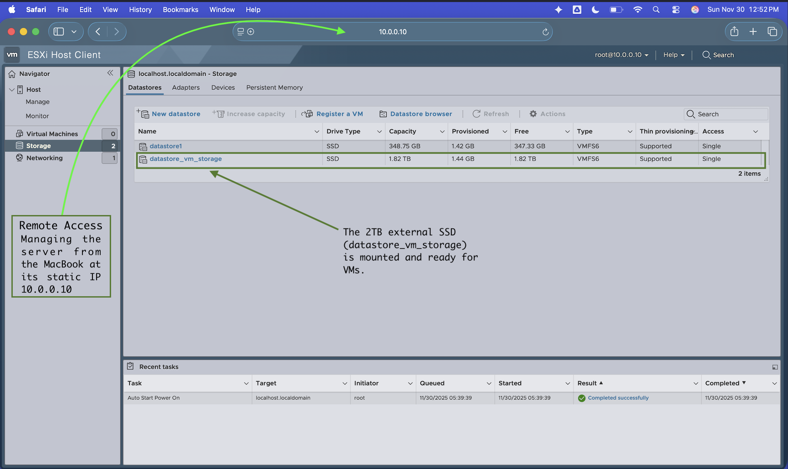 *Figure 7: The VMware ESXi Host Client running in Safari on macOS, showing the successfully mounted datastores*.

---

## ⏭️ Next Steps

. **Security Onion**: Deploying the NSM (Network Security Monitoring) sensor.
. **Kali Linux**: Configuring the attack box.
. **Attack Simulation**: Running the first "live fire" exercise.

