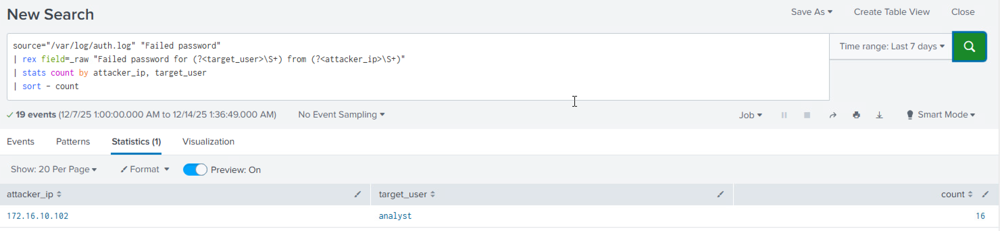
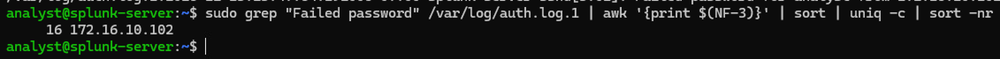
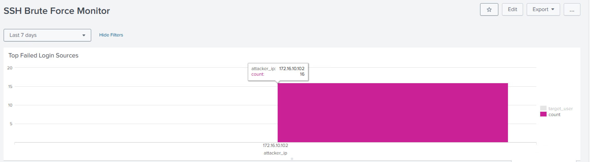
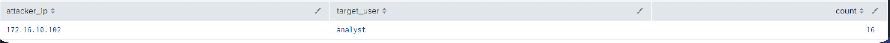

# Phase 1: SSH Brute-Force Attack Analysis & Detection
* **Date:** December 11, 2025
* **Role:** SOC Analyst / Security Engineer
* **Tools:** Kali Linux (Hydra), Ubuntu Server, Splunk Enterprise

## 1. Project Overview
This project simulates an internal threat scenario where an adversary (Red Team) attempts to brute-force SSH credentials on a critical infrastructure server. The goal was to:
1.  **Generate** malicious traffic using industry-standard attack tools.
2.  **Ingest** raw Linux authentication logs into a SIEM (Splunk).
3.  **Analyze** and visualize the attack data to create actionable intelligence.

## 2. Lab Architecture
* **Attacker:** Kali Linux (`172.16.10.x`) running *Hydra*.
* **Target:** Ubuntu Server (`172.16.10.x`) hosting the Splunk instance.
* **SIEM:** Splunk Enterprise, configured to monitor `/var/log/auth.log`.
* **Network:** `LAN_Isolated` (Air-gapped from production home network).
---
graph TD
    %% Define the Network Boundary
    subgraph LAN_Isolated ["☁️ LAN_Isolated (Air-gapped / 172.16.10.x)"]
        direction LR
        
        %% Attacker Node
        subgraph Kali_Linux ["😈 Attacker: Kali Linux"]
            style Kali_Linux fill:#f96,stroke:#333,stroke-width:2px
            Hydra("🔥 Tool: Hydra")
        end

        %% Target Node
        subgraph Ubuntu_Server ["🛡️ Target: Ubuntu Server"]
            style Ubuntu_Server fill:#9cf,stroke:#333,stroke-width:2px
            OS_Auth["📄 /var/log/auth.log"]
            Splunk("🦅 SIEM: Splunk Enterprise")
        end
    end

    %% Relationships and Data Flow
    Hydra -- "Brute Force Attack (SSH/Login)" --> Ubuntu_Server
    Ubuntu_Server -. "Generates Logs" .-> OS_Auth
    Splunk -- "Monitors & Indexes" --> OS_Auth

    %% Styling for better readability
    classDef tool fill:#ff9,stroke:#333,stroke-width:1px;
    classDef log fill:#eee,stroke:#333,stroke-dasharray: 5 5;
    classDef siem fill:#6f6,stroke:#333,stroke-width:2px;

    class Hydra tool;
    class OS_Auth log;
    class Splunk siem;

---

## 3. Execution: Red Team (The Attack)
I utilized **Hydra**, a parallelized login cracker, to simulate a high-velocity password guessing attack against the target's SSH port (22).

**Attack Command:**
```bash
hydra -l analyst -P badpass.txt ssh://172.16.10.101 -t 4 -V
```
**Breakdown:**
* `-l analyst`: Targeting the specific administrative user.
* `-P badpass.txt`: Using a custom dictionary of common weak passwords.
* `ssh://...`: Defining the protocol and target IP.
* `-t 4`: Running 4 concurrent threads to increase attack speed.

---

## 4. Execution: Blue Team (The Defense)

### A. Log Ingestion & Engineering
Splunk was not configured to read Linux system logs by default. I had to configure a new Data Input for `/var/log/auth.log`.
* **Challenge:** Splunk threw an "Access Denied" error when trying to read the file.
* **Root Cause:** The `splunk` user did not have read permissions on root-owned system files.
* **Solution:** I modified the Access Control List (ACL) to grant granular read permissions without elevating the service to root.
    ```bash
    sudo setfacl -m u:splunk:r /var/log/auth.log
    ```

### B. Field Extraction (Normalization)
The default `linux_secure` sourcetype failed to automatically parse the `src_ip` and `user` fields from the Ubuntu 24.04 logs. I utilized Splunk Processing Language (SPL) and Regex to normalize the data on the fly.

**SPL Query:**
```splunk
source="/var/log/auth.log" "Failed password"
| rex field=_raw "Failed password for (?<target_user>\S+) from (?<attacker_ip>\S+)"
| stats count by attacker_ip, target_user
| sort - count
```
<div align="center">
    
</div>

### C. CLI Forensics (The Manual Way)
To verify findings without SIEM dependency, I performed manual log analysis on the Ubuntu server using standard Linux utilities (`grep`, `awk`) to isolate the attacker's IP and frequency.

**Command Chain:**

```bash
grep "Failed password" /var/log/auth.log* | awk '{print $(NF-3)}' | sort | uniq -c | sort -nr
```
* `grep`: Filtered logs for failed login events.
* `awk '{print $(NF-3)}'`: Extracted the IP address (located 4 fields.
  from the end of the line).
* `uniq -c`: Aggregated the count of unique IPs.
<div align="center">
    
</div>

**Forensic Output:**
```Plaintext
16 172.16.10.102
```
*Confirmed 16 failed attempts from the Kali Linux host.*  

### D. Visualization
I created a dashboard panel to track the volume of failed attempts by source IP, providing immediate visibility into the attack vector.
<div align="center" >
    
    <em>Figure 1: The SIEM(Splunk Enterprise) Reveals the Attacker </em>
</div>

---

## 5. Incident Report & Analysis

### Observation (Data)
Splunk detected a spike of **16+ failed authentication attempts** occurring within a 45-second window. All attempts originated from the internal IP `172.16.10.102` and targeted the `analyst` user account.
<table>
    <tr>
        <td><b>SIEM(Splunk) Analysis</b><br/></td>
        <td><b>CLI Forensics</b><br /></td>
    </tr>
</table>

### Impact (Risk)
* **Compromise Risk:** Successful brute-forcing would grant the attacker administrative access to the SIEM, allowing them to delete logs and blind the security team.
* **Lateral Movement:** The source IP belongs to an internal device, indicating a potential breach of the network perimeter or a rogue insider.

### Recommendation (Action)
1.  **Containment:** Isolate the source host (`172.16.10.102`) immediately.
2.  **Hardening:** Disable Password Authentication on the Ubuntu Server (`/etc/ssh/sshd_config`) and enforce SSH Key-Based Authentication only.
3.  **Detection Tuning:** Configure a Splunk Alert to trigger if >5 failed logins occur from a single IP within 1 minute.