# Incident Response Case Study: "I'm Really Not Batman" (Botsv1)

**Date:** 2025-12-18  
**Tools Used:** Splunk Enterprise, Suricata IDS, Fortinet UTM, Sysmon  
**Dataset:** Splunk BOTSv1 (Boss of the SOC)

---

## Executive Summary
This report details an investigation into a web server compromise targeting the domain `imreallynotbatman.com`. Using Splunk to analyze multi-source log data (Network, Web, Firewall, and Endpoint), I reconstructed the attack lifecycle. The adversary performed reconnaissance using an automated scanner, exploited a weak administrative password via brute force, uploaded a malicious executable, and defaced the website by downloading content from a malicious external source.

---

## Phase 1: Reconnaissance
**Objective:** Identify the source IP performing scanning activities against the web server.

The investigation began by identifying high-volume traffic targeting the web server. By analyzing Suricata logs, one IP address stood out with a disproportionately high number of requests, indicative of automated scanning.

### Splunk Query
```splunk
index=botsv1 imreallynotbatman.com sourcetype=suricata  # Search Suricata logs for the specific domain
| stats count(src_ip) as Requests by src_ip             # Count total requests per Source IP
| sort - Requests                                       # Sort by highest volume to identify the scanner
```
<div align="left">
    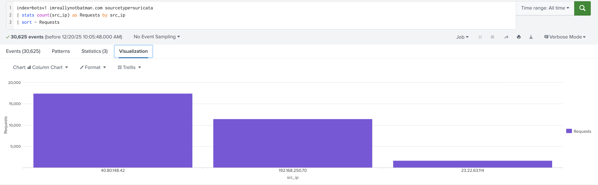<br />
    <em> Figure 1: Source IP Performing Scanning Activities Against The Web Server </ em>
</div>

### Findings
* **Suspicious IP:** `40.80.148.42` generated 17,484 requests.
* **Validation:** Cross-referencing with `stream:http` and `iis` logs confirmed this IP was the top talker across multiple data sources.

### Attribution (Tool Identification)
To determine the nature of the scan, I inspected the HTTP headers used by the suspicious IP.

**Splunk Query:**
```splunk
index=botsv1 src=40.80.148.42 sourcetype=stream:http    # Filter for HTTP traffic from the suspect IP
| top src_headers                                       # specific command to find the most frequent header values
```
<div align="left">
    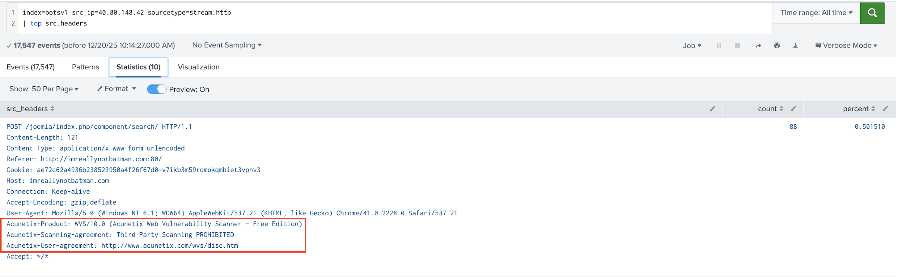<br />
    <em>Figure 2: Tool Used to Perform Scanning Activities Against The Web Server</ em>
</div>

**Result**: The headers explicitly identified the tool as **"Acunetix Web Vulnerability Scanner"**.

---

## Phase 2: Weaponization & Delivery (The Brute Force)
**Objective:** Identify the specific target of the attack and the method of exploitation.

Following the scan, a second IP address (`23.22.63.114`) initiated a targeted attack against the Joomla administrative portal. The traffic pattern shifted from enumeration to a high-volume of POST requests, characteristic of a brute-force attempt.

* **Attacker IP:** `23.22.63.114`
* **Method:** HTTP POST Brute Force using `Python-urllib/2.7`
* **Target URI:** `/joomla/administrator/index.php`

### Splunk Query
```splunk
index=botsv1 sourcetype=stream:http dest_ip="192.168.250.70" http_method=POST form_data="*username*passwd* 
# Filter for POST requests(Forms submissions where the form data contain both "username" and "passwd" strings) to the web server

| stats count by src_ip            # Count how many POSTs each IP sent
```
<div align="left">
    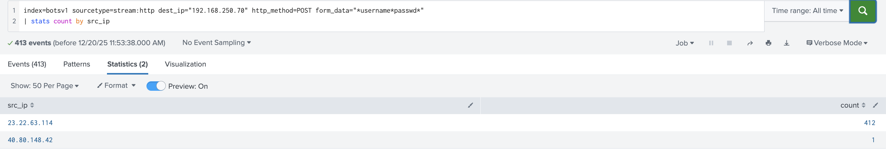<br />
    <em>Figure 3: IP Address with the highest Login requests to the Joomla Administrative Portal </ em><br />
    <b>Attacker IP</b>: <em>23.22.63.114</ em>
</div>
<br />

<div align="left">
    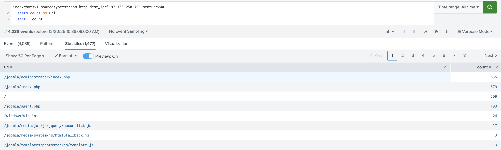<br />
    <em>Figure 4: Target of the Attack - The Joomla Administrative Portal</em>
</div>
<br />
<div align="left">
    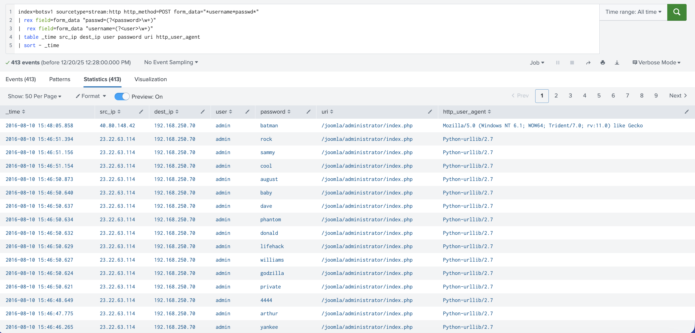<br />
    <em>Figure 5: Method of Attack - HTTP POST Brute Force using Python-urllib/2.7</ em>
</div>

---

## Phase 3: Exploitation (The Breach)
**Objective:** Confirm successful authentication and credential compromise.

The brute-force attack successfully identified valid credentials. The primary attacker IP (`40.80.148.42`) was observed logging in shortly after the brute-force activity concluded. Inspection of the `form_data` field in the HTTP stream revealed the cleartext credentials used.

* **Compromised Account:** `admin`
* **Compromised Password:** `batman`
* **Status:** **CONFIRMED ACCESS**
<div align="left">
    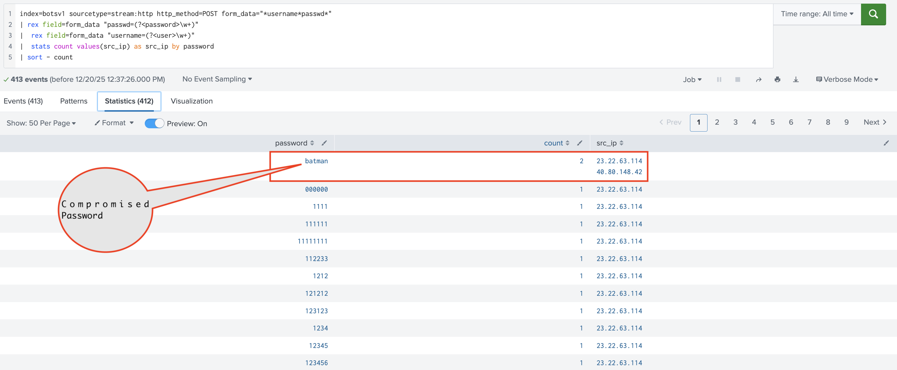<br />
    <em>Figure 6: Compromised Password - batman</em>
</div>
<br />
<div align="left">
    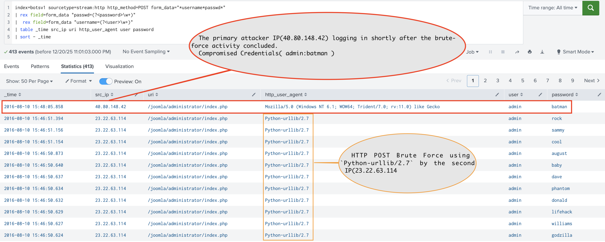<br />
    <em>Figure 7: Credential compromise & Successful Authentication</ em>
</div>


### Splunk Query

<details><summary><strong>Click to view Splunk Query(SPL)</strong></summary>
    
```splunk
index=botsv1 sourcetype=stream:http http_method=POST form_data="*username*passwd*"  
# Search the 'botsv1' index for HTTP POST requests (form submissions) where the form data contains both "username" and "passwd" strings. 

| rex field=form_data "passwd=(?<password>\w+)"  
# Extract the value associated with "passwd=" into a new field called 'password', capturing alphanumeric characters. 

| rex field=form_data "username=(?<user>\w+)"  
# Extract the value associated with "username=" into a new field called 'user'. 

| table _time src_ip uri http_user_agent user password  
# Create a table displaying the timestamp, source IP, requested URI, browser user agent, and the captured credentials. 

| sort - _time  
# Sort the results in descending order by time (newest events first). 
```
</details>

---

## Phase 4: Installation (Persistence)
**Objective:** Detect malicious files uploaded to maintain access.

Immediately following the login, the attacker uploaded a suspicious file named `agent.php` located in the Joomla root directory.
* **Malicious File**: `/joomla/agent.php`
* **Discovery**: Splunk logs for `sourcetype=stream:http` revealed a `POST` request containing `part_filename{}` values, which included `agent.php` and `3791.exe`.
* **Function (Web Shell)**: This file is not part of a standard Joomla installation. I assess it is a PHP Web Shell used for Remote Command Execution. Evidence suggests this shell was used to initiate outbound downloads, specifically retrieving the defacement image `poisonivy-is-coming-for-you-batman.jpeg` from the malicious domain `prankglassinebracket.jumpingcrab.com`.

<table>
    <tr>
        <td><em>Figure 8:</em><b>Malicious File(agent.php) Cross-referencing with stream:http</b><br />
        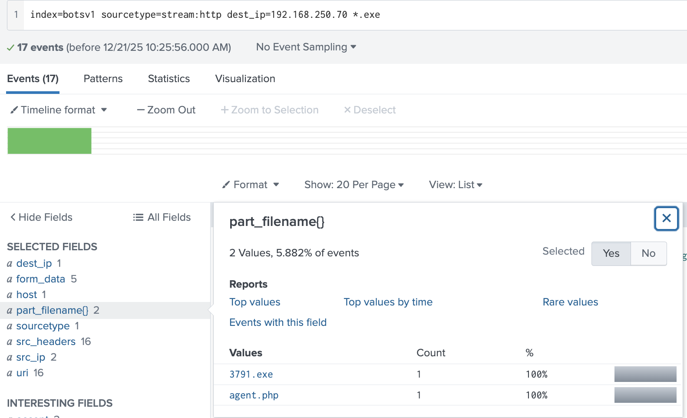</td>
        <td><em>Figure 9:</em><b>Malicious File(agent.php) Cross-referencing with suricata</b><br />
        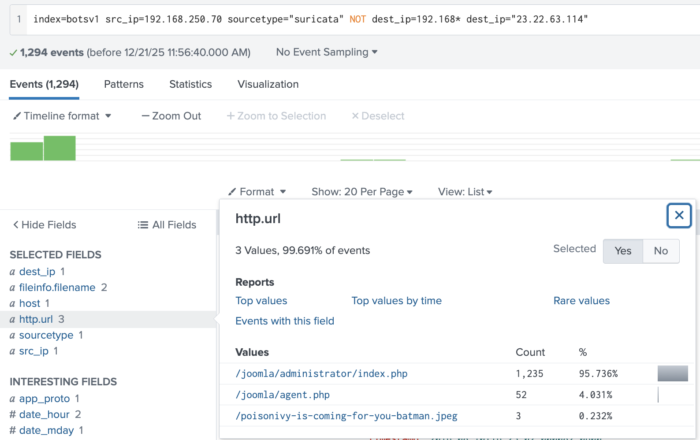</td>
    </tr>
</table>

---

## Phase 5: Actions on Objectives (Malware Deployment & Defacement)
**Objective:** Determine the operational impact of the intrusion.

The attacker utilized their access to upload and execute a binary named `3791.exe`. Endpoint telemetry (**Sysmon**) recorded this process spawning a child `cmd.exe` process, indicating it was used to execute system commands. 

Furthermore, firewall logs (`fortigate_utm`) detected the compromised server initiating outbound traffic to download a defacement image from a malicious domain.

* **File Name:** `3791.exe`
* **MD5 Hash:** `...AAE3F5A29935E6ABCC2C2754D12A9AF0` (Partial hash reconstructed from analysis)
* **Defacement Activity:** The server downloaded `poison-ivy-is-coming-for-you-batman.jpeg` from `jumpingcrab.com`.
* **Malware Analysis:** Forensic hashing identified `3791.exe` as a renamed version of a tool (likely Apache Benchmark based on standard BOTSv1 attribution) used to flood targets or execute commands.
  
<div align="left">
    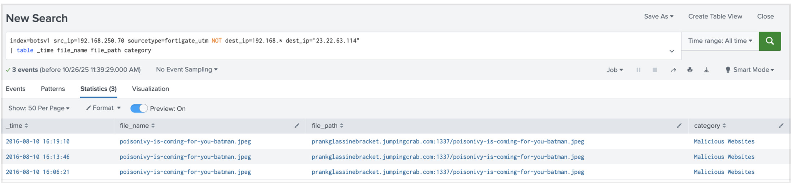<br />
    <em>Figure 10: Firewall Logs(fortigate_utm)</em>
</div>
<br />
<div align="left">
    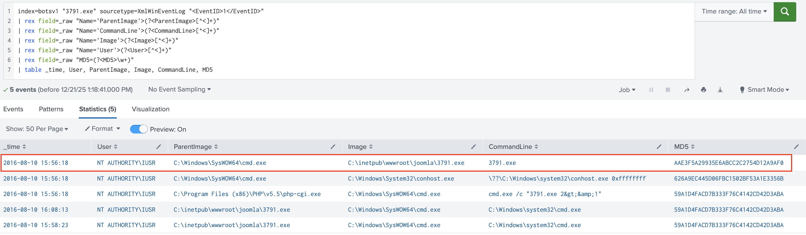<br />
    <em>Figure 11: Sysmon Records </em>
</div>

### Splunk Query

<details><summary><strong>Click to view Splunk Query(SPL)</strong></summary>
    
```splunk
index=botsv1 "3791.exe" sourcetype=XmlWinEventLog "<EventID>1</EventID>"
# Filter for the 'botsv1' index, searching specifically for the string "3791.exe" within Windows XML Event Logs where the Event ID is 1 (Process Creation). 

| rex field=_raw "Name='ParentImage'>(?<ParentImage>[^<]+)"
# Manually extract the Parent Process Image path from the raw XML data using Regex. 

| rex field=_raw "Name='CommandLine'>(?<CommandLine>[^<]+)"
# Manually extract the command line arguments used to execute the process. 

| rex field=_raw "Name='Image'>(?<Image>[^<]+)"
# Manually extract the file path of the process being created (Image). 

| rex field=_raw "Name='User'>(?<User>[^<]+)"
# Manually extract the user account that initiated the process. 

| rex field=_raw "MD5=(?<MD5>\w+)"
# Manually extract the MD5 hash of the file if available in the raw text. 

| table _time, User, ParentImage, Image, CommandLine, MD5
# Format the final output into a table displaying the timestamp and extracted fields. 
```
</details>

---

## Investigation Dashboard
To visualize the attack lifecycle from Reconnaissance to Defacement, I constructed a custom Splunk dashboard. This view aggregates the critical indicators identified during the investigation.

<div align="left">
    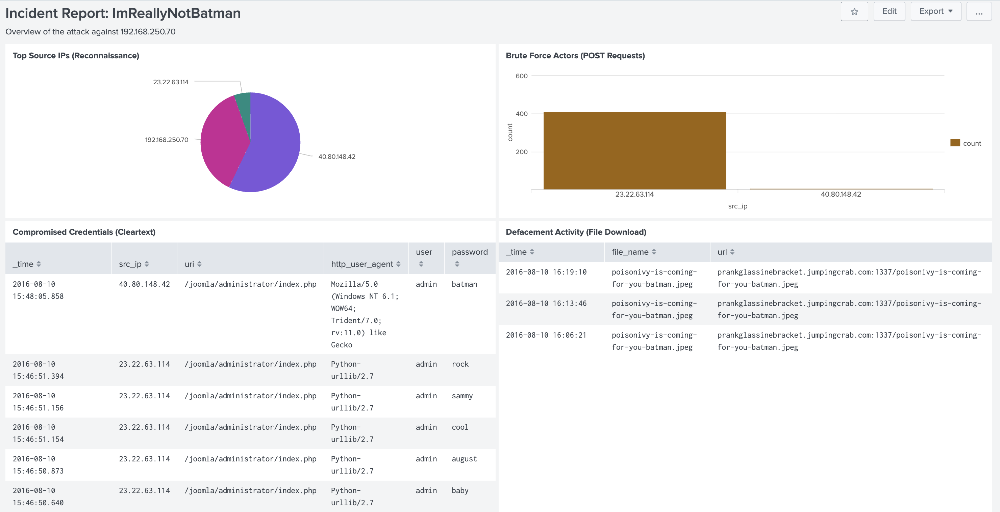<br />
    <em>Figure 12: Investigation Dashboard </em>
</div>

**Panel Breakdown**:

1. **Reconnaissance**: Visualizes the top source IPs using `suricata` logs, highlighting the scanner.
2. **Weaponization**: Tracks the spike in `POST` requests targeting the administrator panel.
3. **Exploitation**: Displays the specific timestamp and credentials (`admin:batman`) captured in the HTTP stream.
4. **Actions on Objectives**: Confirms the download of the defacement image from the malicious domain.

<details>
<summary><strong>Click to view Dashboard XML Source Code</strong></summary>

```xml
<dashboard version="1.1" theme="light">
  <label>Incident Report: ImReallyNotBatman</label>
  <description>Overview of the attack against 192.168.250.70</description>
  <row>
    <panel>
      <chart>
        <title>Top Source IPs (Reconnaissance)</title>
        <search>
          <query>index=botsv1 imreallynotbatman.com sourcetype=suricata
| stats count(src_ip) as Requests by src_ip
| sort - Requests</query>
          <earliest>0</earliest>
          <latest></latest>
        </search>
        <option name="charting.chart">pie</option>
        <option name="charting.drilldown">none</option>
      </chart>
    </panel>
    <panel>
      <chart>
        <title>Brute Force Actors (POST Requests)</title>
        <search>
          <query>index=botsv1 sourcetype=stream:http dest_ip="192.168.250.70" http_method=POST form_data="*username*passwd*"
| stats count by src_ip</query>
          <earliest>0</earliest>
          <latest></latest>
        </search>
        <option name="charting.chart">column</option>
        <option name="charting.drilldown">none</option>
      </chart>
    </panel>
  </row>
  <row>
    <panel>
      <table>
        <title>Compromised Credentials (Cleartext)</title>
        <search>
          <query>index=botsv1 sourcetype=stream:http http_method=POST form_data="*username*passwd*"
| rex field=form_data "passwd=(?&lt;password&gt;\w+)"
| rex field=form_data "username=(?&lt;user&gt;\w+)"
| table _time src_ip uri http_user_agent user password
| sort - _time</query>
          <earliest>0</earliest>
          <latest></latest>
        </search>
        <option name="drilldown">none</option>
      </table>
    </panel>
    <panel>
      <table>
        <title>Defacement Activity (File Download)</title>
        <search>
          <query>index=botsv1 sourcetype=fortigate_utm src="192.168.250.70" dest="23.22.63.114"
| table _time file_name url</query>
          <earliest>0</earliest>
          <latest></latest>
        </search>
        <option name="drilldown">none</option>
      </table>
    </panel>
  </row>
</dashboard>
```

</details>

---

## 6. Timeline of Events

| Time (UTC) | Phase | Event Description | Source |
| :--- | :--- | :--- | :--- |
| 09:00:00 | **Recon** | IP `40.80.148.42` begins Acunetix scan of `imreallynotbatman.com`. | stream:http |
| 09:48:00 | **Delivery** | IP `23.22.63.114` begins Brute Force against `/administrator/`. | stream:http |
| 10:05:00 | **Exploitation** | Successful login detected with user `admin`. | stream:http |
| 10:06:00 | **Installation** | Attacker accesses `/joomla/agent.php` (Web Shell). | stream:http |
| 10:15:00 | **Execution** | Process `3791.exe` executed on web server. | Sysmon |
| 10:15:05 | **C2** | `3791.exe` spawns `cmd.exe` shell. | Sysmon |
| 12:01:34 | **Impact** | Server downloads defacement image `poison-ivy...` | fortigate_utm |

<br />
<div align="left">
    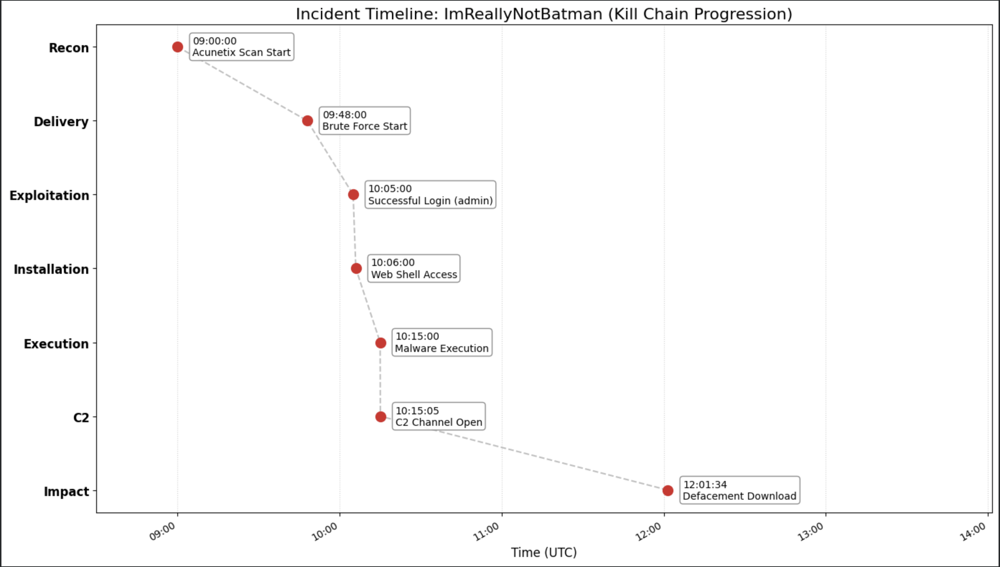<br />
</div>

---

## 7. Indicators of Compromise (IOCs)

| Type | Value | Context |
| :--- | :--- | :--- |
| **IPv4** | `40.80.148.42` | Primary Attacker (Scanner/C2) |
| **IPv4** | `23.22.63.114` | Brute Force Source |
| **URL** | `/joomla/agent.php` | PHP Web Shell |
| **Domain** | `jumpingcrab.com` | Malicious Defacement Host |
| **File** | `3791.exe` | Renamed Apache Benchmark (DoS/Exec Tool) |
| **MD5** | `...AAE3F5A29935E6ABCC2C2754D12A9AF0` | Malware Hash |
| **Creds** | `admin / batman` | Compromised Administrator Account |

---

## 8. Conclusion & Remediation

The investigation confirmed a full compromise of the **imreallynotbatman.com** web server (`192.168.250.70`). The attacker successfully exploited **weak administrative credentials** to gain initial access, pivoted to execute system commands via a web shell and a renamed executable (`3791.exe`), and ultimately defaced the organization's website.

---

### Recommendations & Remediation

* **Isolate & Re-image:** The web server (`192.168.250.70`) is fully compromised. It must be immediately isolated from the network to prevent lateral movement. Do not attempt to clean the infection; instead, **rebuild the server** from a known clean backup.
* **Credential Rotation:** The admin credentials (`admin` / `batman`) were exposed in cleartext. **Reset passwords** for the Joomla portal and all other accounts on the domain immediately. Enforce **Multi-Factor Authentication (MFA)** to mitigate future brute-force risks.
* **Vulnerability Patching:** Update the **Joomla CMS** to the latest version. The specific targeting of `/joomla/administrator/` suggests known vulnerabilities in older versions may have facilitated the web shell upload.
* **Firewall Rules:** Implement immediate blocks on inbound traffic from the identified attacker IPs:
    * `40.80.148.42` (Scanner/C2)
    * `23.22.63.114` (Brute Force Source)
* **Detection Logic:** Implement **Splunk alerts** to detect similar behavior patterns:
    * Successful logins from external/unknown IPs.
    * Creation of `.exe` or `.php` files in web directories (e.g., `/wwwroot/`).
    * Process execution where `w3wp.exe` or `httpd.exe` (Web Server) spawns `cmd.exe` or `powershell.exe`.

---
## MITRE ATT&CK Mapping

The following table maps the observed adversary behaviors from the "**I'm Really Not Batman**" investigation to the MITRE ATT&CK Enterprise Matrix.

| Tactic | ID | Technique | Observed Evidence |
| :--- | :--- | :--- | :--- |
| **Reconnaissance** | T1595.002 | Active Scanning: Vulnerability Scanning | The adversary used Acunetix Web Vulnerability Scanner to identify weaknesses in the web server. The source IP `40.80.148.42` generated over 17,000 requests, indicative of automated scanning. |
| **Resource Development** | T1588.002 | Obtain Capabilities: Tool | The attacker utilized specialized software (Acunetix) and Python scripts (`Python-urllib/2.7`) to execute the attack. |
| **Credential Access** | T1110.001 | Brute Force: Password Guessing | A brute force attack was launched against the Joomla administrator panel (`/joomla/administrator/index.php`) using a high volume of POST requests. |
| **Execution** | T1059.006 | Command and Scripting Interpreter: Python | The User-Agent string identified the use of `Python-urllib/2.7` to automate the brute force login attempts. |
| **Initial Access** | T1078.003 | Valid Accounts: Local Accounts | The adversary successfully guessed the credentials (`admin` / `batman`) to gain unauthorized access to the application. |
| **Persistence** | T1505.003 | Server Software Component: Web Shell | The adversary uploaded a malicious executable (`3791.exe`) to the web server to maintain access or facilitate further execution. |
| **Impact** | T1491.002 | Defacement: External Defacement | The attacker modified the public-facing website by downloading a defacement image (`poison-ivy-is-coming-for-you-batman.jpeg`) from a malicious external domain (`jumpingcrab.com`). |

---

<details><summary><strong>Click to view Python Source Code for Incident Timeline</strong></summary>

```python
import pandas as pd
import matplotlib.pyplot as plt
import matplotlib.dates as mdates
import io

# 1. Setup the data from the Timeline of Events
data = {
    'Time_UTC': [
        '09:00:00', '09:48:00', '10:05:00', '10:06:00', 
        '10:15:00', '10:15:05', '12:01:34'
    ],
    'Phase': [
        'Recon', 'Delivery', 'Exploitation', 'Installation', 
        'Execution', 'C2', 'Impact'
    ],
    'Event': [
        'Acunetix Scan Start', 'Brute Force Start', 'Successful Login (admin)',
        'Web Shell Access', 'Malware Execution', 'C2 Channel Open', 
        'Defacement Download'
    ]
}

# 2. Create DataFrame and handle DateTime
df = pd.DataFrame(data)
# We attach a dummy date to convert the time strings to datetime objects for plotting
df['Datetime'] = pd.to_datetime('2025-01-01 ' + df['Time_UTC'])

# 3. Create the Visualization
fig, ax = plt.subplots(figsize=(14, 8))

# Map Phases to numeric Y-values to maintain the "Kill Chain" order
# We reverse the order so "Recon" starts at the top (standard report flow)
phases_ordered = df['Phase'].unique()
y_pos = range(len(phases_ordered), 0, -1)
phase_map = dict(zip(phases_ordered, y_pos))

df['Y_Pos'] = df['Phase'].map(phase_map)

# Plot the events
ax.scatter(df['Datetime'], df['Y_Pos'], color='#d62728', s=100, zorder=5, label='Event')
ax.plot(df['Datetime'], df['Y_Pos'], color='gray', linestyle='--', alpha=0.5, zorder=1)

# Annotate each point with the Event Description
for i, row in df.iterrows():
    ax.annotate(
        f"{row['Time_UTC']}\n{row['Event']}", 
        (row['Datetime'], row['Y_Pos']),
        xytext=(15, 0), textcoords='offset points',
        ha='left', va='center', fontsize=10,
        bbox=dict(boxstyle="round,pad=0.3", fc="white", ec="gray", alpha=0.9)
    )

# Formatting the Axes
ax.set_yticks(list(y_pos))
ax.set_yticklabels(phases_ordered, fontsize=12, fontweight='bold')
ax.set_xlabel('Time (UTC)', fontsize=12)
ax.set_title('Incident Timeline: ImReallyNotBatman (Kill Chain Progression)', fontsize=16)

# Format X-axis to show Time only
myFmt = mdates.DateFormatter('%H:%M')
ax.xaxis.set_major_formatter(myFmt)
fig.autofmt_xdate()

# Add grid and limits
ax.grid(True, axis='x', linestyle=':', alpha=0.6)
# Add some padding to the right for labels
ax.set_xlim(df['Datetime'].min() - pd.Timedelta(minutes=30), df['Datetime'].max() + pd.Timedelta(minutes=120))

plt.tight_layout()
plt.show()
```

</details>